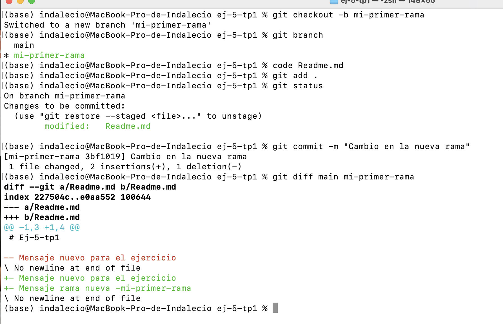
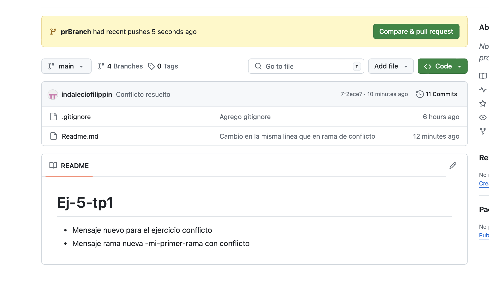
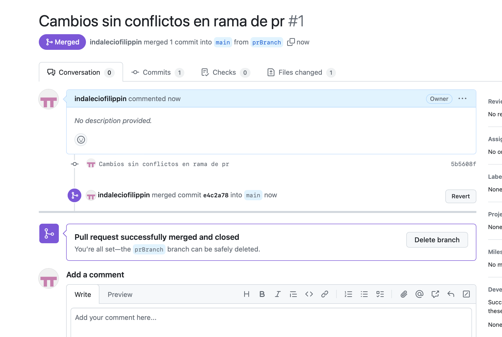

# Trabajo Practico 1 - git Basico

## 2- Crear un repositorio local y agregar archivos

#### - Crear un repositorio local en un nuevo directorio

#### - Agregar un archivo Readme.md, agregar algunas líneas con texto a dicho archivo

#### - Crear un commit y proveer un mensaje descriptivo

## 4- Creación de Repos 01 -> Crearlo en GitHub, clonarlo localmente y subir cambios

#### - Crear un nuevo repositorio en dicha página con el Readme.md por defecto

#### - Clonar el repo remoto en un nuevo directorio local

#### - Editar archivo Readme.md agregando algunas lineas de texto

#### - Editar (o crear si no existe) el archivo .gitignore agregando los archivos *.bak

#### - Crear un commit y porveer un mensaje descriptivo

#### - Intentar un push al repo remoto

#### - En caso de ser necesario configurar las claves SSH requeridas y reintentar el push

## 5- Creación de Repos 02-> Crearlo localmente y subirlo a GitHub

#### - Crear un repo local

#### - Agregar archivo Readme.md con algunas lineas de texto

#### - Crear repo remoto en GitHub

#### - Asociar repo local con remoto

#### - Crear archivo .gitignore

#### - Crear un commit y proveer un mensaje descriptivo

#### - Subir cambios

## 6- Ramas

#### - Crear una nueva rama

#### - Cambiarse a esa rama

#### - Hacer un cambio en el archivo Readme.md y hacer commit

#### - Revisar la diferencia entre ramas

## 7- Merges

#### - Hacer un merge FF

#### - Borrar la rama creada

#### - Ver el log de commits

#### - Repetir el ejercicio 6 para poder hacer un merge con No-FF

- Me confundi, asi que hice merge con la main, es lo mismo el ejercicio. 

## 8- Resolución de Conflictos

#### - Crear una nueva rama conflictBranch

#### - Realizar una modificación en la linea 1 del Readme

#### - En la conflictBranch modificar la misma línea del Readme.md y commitear

#### - Ver las diferencias con git difftool main conflictBranch

#### - Cambiarse a la rama main e intentar mergear con la rama conflictBranch

#### - Resolver el conflicto con git mergetool

- Elegi quedarme con el cambio actual

#### - Agregar .orig al .gitignore

#### - Hacer commit y push

## 9- Familiarizarse con el concepto de Pull Request

#### - Explicar que es un pull request

- Un pull request es una solicitud que un desarrollador hace para que los cambios que ha hecho en su rama de trabajo (generalmente en un repositorio de Git) sean revisados e integrados en la rama principal (o cualquier otra rama).

#### - Crear un branch local y agregar cambios a dicho branch

#### - Subir el cambio a dicho branch y crear un pull request

#### - Completar el proceso de revisión en github y mergear el PR al branch master

