## Trabajo Práctico 2 - Introducción a Docker

#### 3- Obtener la imagen BusyBox

- Ejecutar el siguiente comando, para bajar una imagen de DockerHub

  ```bash
  docker pull busybox
  ```

  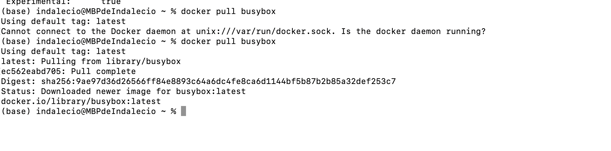

- Verificar qué versión y tamaño tiene la imagen bajada, obtener una lista de imágenes locales:

```bash
docker images
```

  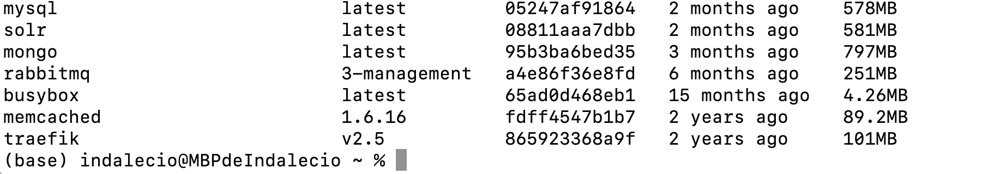

#### 4- Ejecutando contenedores

- Ejecutar un contenedor utilizando el comando **run** de docker:

```bash
docker run busybox
```

  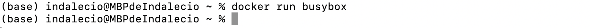

- Explicar porque no se obtuvo ningún resultado

  El comando docker run busybox no mostró ningún resultado porque BusyBox, al no recibir un comando específico, se ejecuta y finaliza inmediatamente sin realizar ninguna acción visible. Para ver un resultado, puedes pasar un comando como docker run busybox ls, que listará el contenido del directorio raíz del contenedor antes de cerrarse.

- Especificamos algún comando a correr dentro del contenedor, ejecutar por ejemplo:

```bash
docker run busybox echo "Hola Mundo"
```

 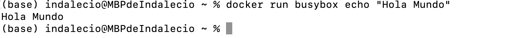

- Ver los contenedores ejecutados utilizando el comando **ps**:

```bash
docker ps
```

 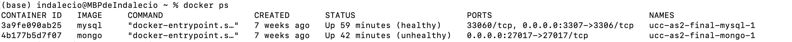

- Vemos que no existe nada en ejecución, correr entonces:

```bash
docker ps -a
```

 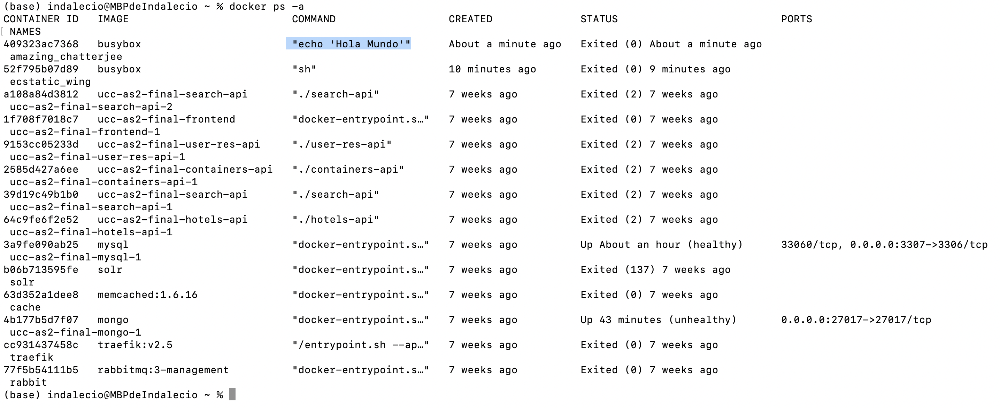

- Mostrar el resultado y explicar que se obtuvo como salida del comando anterior.

    La salida de docker ps -a muestra que el contenedor que ejecutó echo "Hola Mundo" fue creado y detenido automáticamente después de ejecutar su tarea. Esto es típico cuando se ejecuta un comando que no mantiene el contenedor en ejecución (como echo).

#### 5- Ejecutando en modo interactivo

- Ejecutar el siguiente comando

```bash
docker run -it busybox sh
```

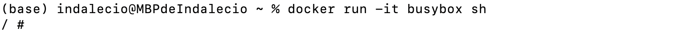

- Para cada uno de los siguientes comandos dentro de contenedor, mostrar los resultados:

```bash
ps
uptime
free
ls -l /
```

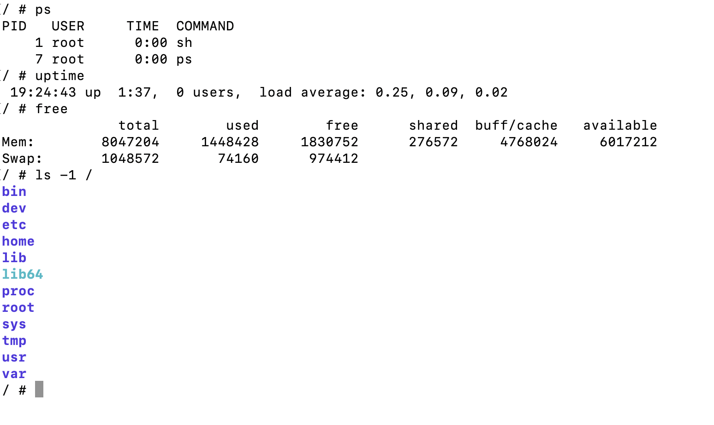

- Salimos del contenedor con:

```bash
exit
```

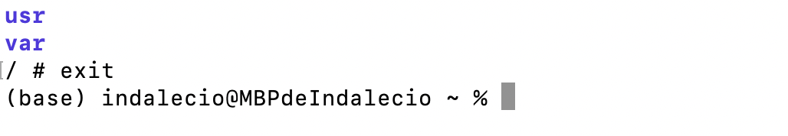

#### 6- Borrando contenedores terminados

- Obtener la lista de contenedores

```bash
docker ps -a
```

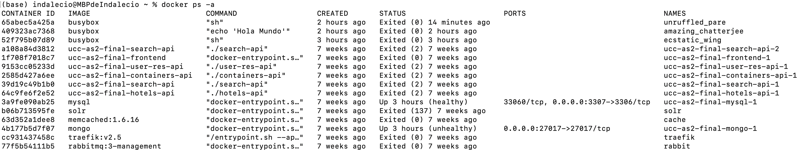

- Para borrar podemos utilizar el id o el nombre (autogenerado si no se especifica) de contenedor que se desee, por ejemplo:

```bash
docker rm elated_lalande
```

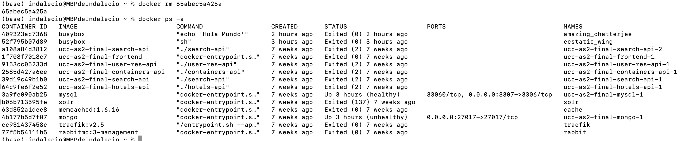

- Para borrar todos los contenedores que no estén corriendo, ejecutar cualquiera de los siguientes comandos:

```bash
docker rm $(docker ps -a -q -f status=exited)
```

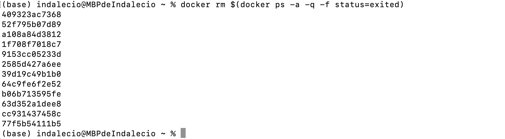

```bash
docker container prune
```

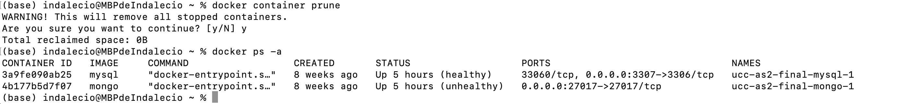

#### 7- Construir una imagen

- Conceptos de DockerFile
  - Leer <https://docs.docker.com/engine/reference/builder/>
  - Describir las instrucciones
    - FROM
    Define la imagen base que se usará para crear tu nueva imagen. Es la primera instrucción en un Dockerfile. Por ejemplo, `FROM ubuntu:20.04` indica que la imagen se basará en Ubuntu 20.04.

    - RUN
    Ejecuta comandos en la imagen durante la construcción. Se usa para instalar paquetes, configurar el sistema, etc. Por ejemplo, `RUN apt-get update && apt-get install -y nginx` instalará Nginx en la imagen.

    - ADD
    Copia archivos/directorios desde tu sistema host al sistema de archivos de la imagen y puede hacer extracción automática si el archivo es un archivo comprimido. Por ejeƒmplo, `ADD file.tar.gz /tmp/` descomprimirá `file.tar.gz` en el directorio `/tmp/` de la imagen.

    - COPY
    Similar a `ADD`, pero sin funciones adicionales como descomprimir archivos. Solo copia archivos/directorios desde tu sistema host al sistema de archivos de la imagen. Por ejemplo, `COPY . /app` copiará todos los archivos desde el directorio actual en tu host al directorio `/app` en la imagen.

    - EXPOSE
    Indica que el contenedor escucha en un puerto específico en tiempo de ejecución. No abre el puerto en la máquina host, pero documenta cuál es el puerto expuesto. Por ejemplo, `EXPOSE 80` indica que el contenedor escuchará en el puerto 80.

    - CMD
    Especifica el comando que se ejecutará cuando el contenedor se inicie. Solo puede haber una instrucción `CMD` en un Dockerfile. Si se proporcionan argumentos a la `docker run`, esta instrucción se sobrescribe. Por ejemplo, CMD ["nginx", "-g", "daemon off;"].

    - ENTRYPOINT
    Similar a CMD, pero no se sobrescribe si se proporcionan argumentos a la docker run. Se usa para definir el comando principal a ejecutar. Por ejemplo, `ENTRYPOINT ["nginx"]`.

- A partir del código <https://github.com/ingsoft3ucc/SimpleWebAPI> crearemos una imagen.
- Clonar repo

    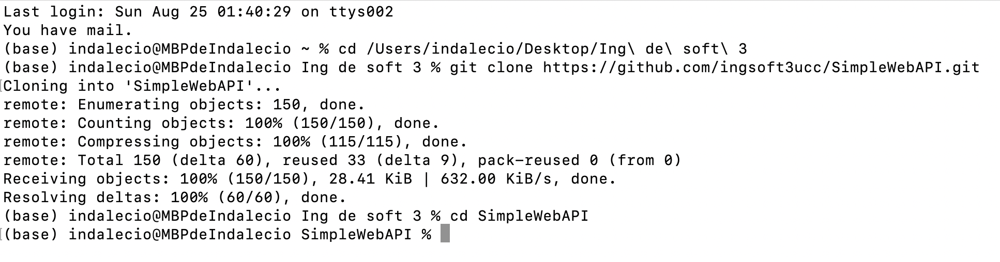

- Crear imagen etiquetándola con un nombre. El punto final le indica a Docker que use el dir actual

```
docker build -t mywebapi .
```

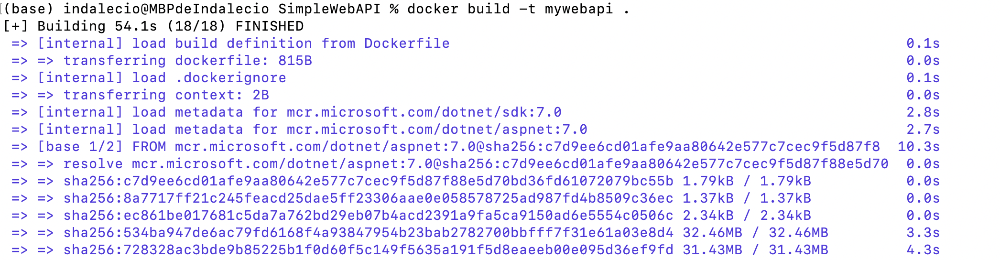

- Revisar Dockerfile y explicar cada línea

- FROM mcr.microsoft.com/dotnet/aspnet:7.0 AS base: Establece la imagen base para el contenedor final. Esta imagen contiene el runtime de ASP.NET Core 7.0, que es necesario para ejecutar la aplicación. La imagen se etiqueta como base.

- WORKDIR /app: Define /app como el directorio de trabajo dentro del contenedor. Es donde se copiarán y ejecutarán los archivos de la aplicación.

- EXPOSE 80, 443, 5254: Declara que el contenedor escuchará en los puertos 80, 443, y 5254. Estos son los puertos que normalmente se utilizan para HTTP, HTTPS, y otro servicio específico de tu aplicación.

- FROM mcr.microsoft.com/dotnet/sdk:7.0 AS build: Utiliza la imagen SDK de .NET Core 7.0, que incluye herramientas para construir y compilar la aplicación. Se etiqueta esta imagen como build.

- WORKDIR /src: Establece el directorio de trabajo /src para la fase de construcción.

- COPY ["SimpleWebAPI/SimpleWebAPI.csproj", "SimpleWebAPI/"]: Copia el archivo de proyecto (SimpleWebAPI.csproj) en el contenedor en el directorio SimpleWebAPI. Esto asegura que solo se copie lo necesario para restaurar las dependencias.
RUN dotnet restore "SimpleWebAPI/SimpleWebAPI.csproj": Ejecuta el comando dotnet restore para descargar todas las dependencias necesarias según el archivo de proyecto.

- COPY . .: Copia todos los archivos desde el directorio actual en tu máquina local al directorio de trabajo en el contenedor.

- WORKDIR "/src/SimpleWebAPI": Cambia el directorio de trabajo a donde está la aplicación.

- RUN dotnet build "SimpleWebAPI.csproj" -c Release -o /app/build: Compila la aplicación en modo Release y coloca los binarios en el directorio /app/build.

- FROM build AS publish: Reutiliza la imagen creada en la fase de build, etiquetándola como publish.

- RUN dotnet publish "SimpleWebAPI.csproj" -c Release -o /app/publish /p
=false: Publica la aplicación, optimizándola para producción, y coloca los archivos resultantes en el directorio /app/publish. La opción /p:UseAppHost=false desactiva la creación de un ejecutable nativo para la aplicación, lo que puede hacer las imágenes más ligeras.

- FROM base AS final: Reutiliza la imagen base de la primera fase (base), etiquetándola como final.
WORKDIR /app: Establece el directorio de trabajo en /app nuevamente.

- COPY --from=publish /app/publish .: Copia los archivos publicados desde la fase publish a la imagen final.

- ENTRYPOINT ["dotnet", "SimpleWebAPI.dll"]: Define el punto de entrada del contenedor, ejecutando la aplicación con dotnet SimpleWebAPI.dll.

- CMD ["/bin/bash"]: Está comentado y no se ejecuta, pero indica que podrías cambiar el comando de inicio a una shell de Bash si lo deseas.

- Ver imágenes disponibles

    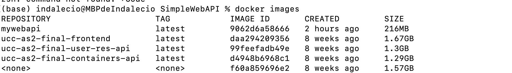

- Ejecutar un contenedor con nuestra imagen

    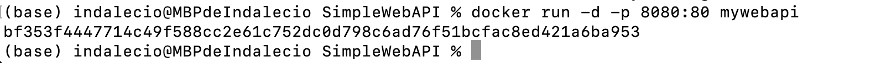

- Subir imagen a nuestra cuenta de dockerhub
  - 7.1 Inicia sesión en Docker Hub
    - Primero, asegúrate de estar autenticado en Docker Hub desde tu terminal:

    ```bash
    docker login
    ```

  - 7.2 Etiquetar la imagen a subir con tu nombre de usuario de Docker Hub y el nombre de la imagen. Por ejemplo:

    ```bash
    docker tag <nombre_imagen_local> <tu_usuario_dockerhub>/<nombre_imagen>:<tag>
    ```

  - 7.3 Subir la Imagen
    - Para subir la imagen etiquetada a Docker Hub, utiliza el comando docker push:

     ```bash
     docker push <tu_usuario_dockerhub>/<nombre_imagen>:<tag>
     ```

  - 7.4 Verificar la Subida

     ```bash
     docker pull <tu_usuario_dockerhub>/<nombre_imagen>:<tag>
     ```

    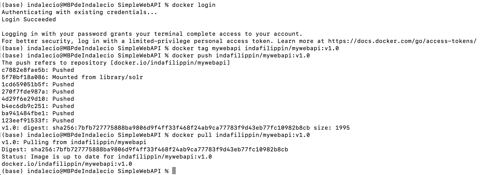

#### 8- Publicando puertos

En el caso de aplicaciones web o base de datos donde se interactúa con estas aplicaciones a través de un puerto al cual hay que acceder, estos puertos están visibles solo dentro del contenedor. Si queremos acceder desde el exterior deberemos exponerlos.

- Ejecutar la siguiente imagen, en este caso utilizamos la bandera -d (detach) para que nos devuelva el control de la consola:

```bash
docker run --name myapi -d mywebapi
```

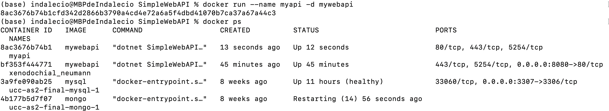

- Ejecutamos un comando ps:
- Vemos que el contendor expone 3 puertos el 80, el 5254 y el 443, pero si intentamos en un navegador acceder a <http://localhost/WeatherForecast> no sucede nada.

- Procedemos entonces a parar y remover este contenedor:

```bash
docker kill myapi
docker rm myapi
```

- Vamos a volver a correrlo otra vez, pero publicando el puerto 80

```bash
docker run --name myapi -d -p 80:80 mywebapi
```

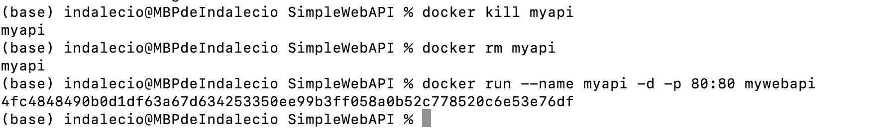

- Accedamos nuevamente a <http://localhost/WeatherForecast> y vemos que nos devuelve datos.

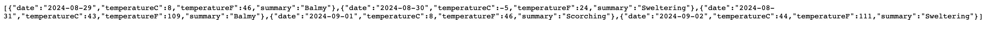

#### 9- Modificar Dockerfile para soportar bash

- Modificamos dockerfile para que entre en bash sin ejecutar automaticamente la app

```bash
#ENTRYPOINT ["dotnet", "SimpleWebAPI.dll"]
CMD ["/bin/bash"]
```

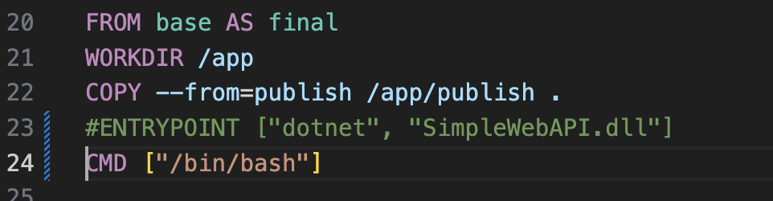

- Rehacemos la imagen

```
docker build -t mywebapi .
```

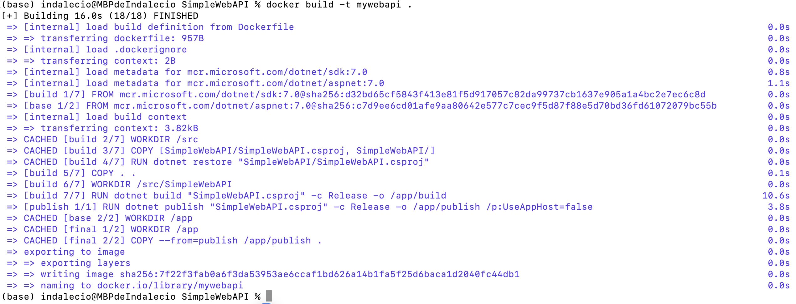

- Corremos contenedor en modo interactivo exponiendo puerto

```
docker run -it --rm -p 80:80 mywebapi
```

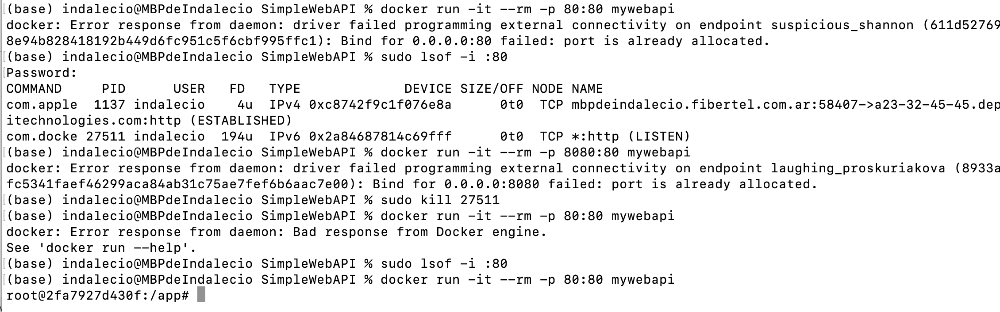

- Navegamos a <http://localhost/weatherforecast>
- Vemos que no se ejecuta automaticamente

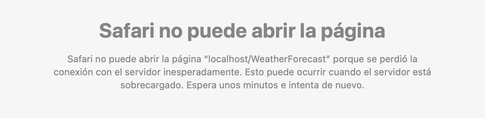

- Ejecutamos app:

```
dotnet SimpleWebAPI.dll
```

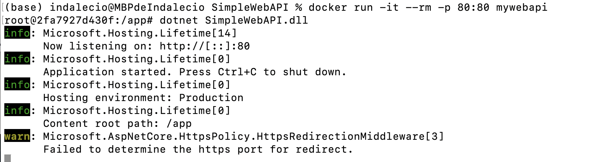

-Volvemos a navegar a <http://localhost/weatherforecast>

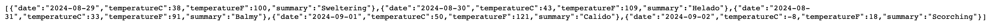

- Salimos del contenedor

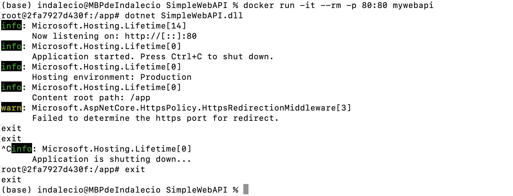

#### 10- Montando volúmenes

Hasta este punto los contenedores ejecutados no tenían contacto con el exterior, ellos corrían en su propio entorno hasta que terminaran su ejecución. Ahora veremos cómo montar un volumen dentro del contenedor para visualizar por ejemplo archivos del sistema huésped:

- Ejecutar el siguiente comando, cambiar myusuario por el usuario que corresponda. En Mac puede utilizarse /Users/miusuario/temp):

```bash
docker run -it --rm -p 80:80 -v /Users/miuser/temp:/var/temp  mywebapi
```

- Dentro del contenedor correr

```bash
ls -l /var/temp
touch /var/temp/hola.txt
```

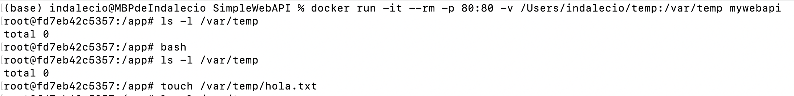

- Verificar que el Archivo se ha creado en el directorio del guest y del host.

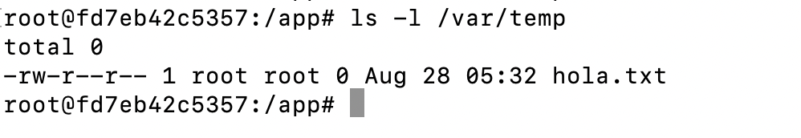

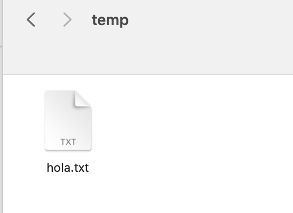

#### 11- Utilizando una base de datos

- Levantar una base de datos PostgreSQL

```bash
mkdir $HOME/.postgres

docker run --name my-postgres -e POSTGRES_PASSWORD=mysecretpassword -v $HOME/.postgres:/var/lib/postgresql/data -p 5432:5432 -d postgres:9.4
```

- Ejecutar sentencias utilizando esta instancia

```bash
docker exec -it my-postgres /bin/bash

psql -h localhost -U postgres

#Estos comandos se corren una vez conectados a la base

\l
create database test;
\connect test
create table tabla_a (mensaje varchar(50));
insert into tabla_a (mensaje) values('Hola mundo!');
select * from tabla_a;

\q

exit
```

- Conectarse a la base utilizando alguna IDE (Dbeaver - <https://dbeaver.io/>, Azure DataStudio -<https://azure.microsoft.com/es-es/products/data-studio>, etc). Interactuar con los objectos objectos creados.

- Explicar que se logro con el comando `docker run` y `docker exec` ejecutados en este ejercicio.

#### 12- Hacer el punto 11 con Microsoft SQL Server

- Armar un contenedor con SQL Server
- Crear BD, Tablas y ejecutar SELECT
