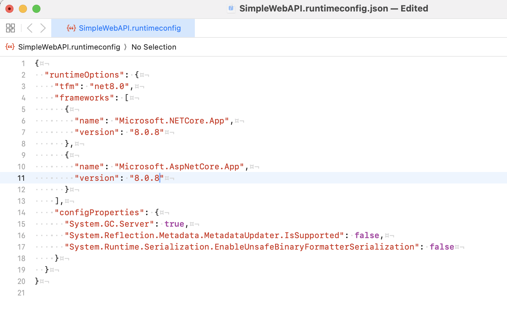
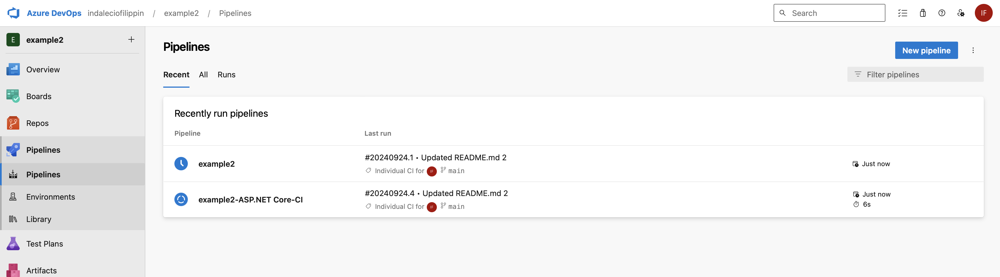
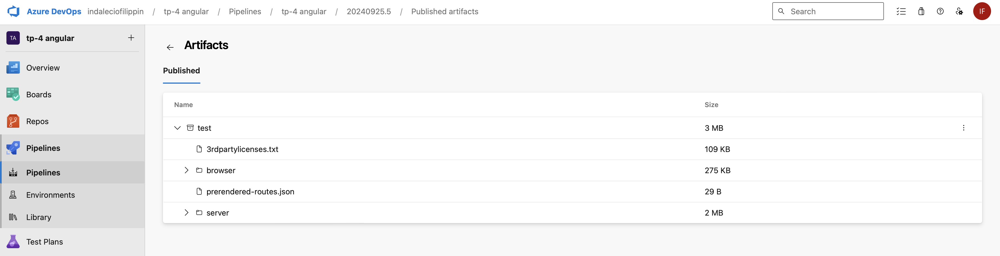

## Trabajo Práctico 4 - Azure Devops Pipelines

### 2- Agregar en pipeline YAML una tarea de Publish

Se agrega en el pipeline una tarea de publish y se hace un commit de los cambios que automáticamente corre el pipeline nuevamente.

### 3- Explicar por qué es necesario contar con una tarea de Publish en un pipeline que corre en un agente de Microsoft en la nube

- En un pipeline que corre en un agente de Microsoft en la nube, es necesario incluir una tarea de Publish para:

  - Persistencia de Artefactos: Los agentes de Microsoft-hosted son efímeros, lo que significa que los archivos generados durante la ejecución se perderían si no se publican. La tarea de Publish guarda estos artefactos en Azure DevOps, asegurando su disponibilidad para etapas posteriores.

  - Despliegues y Etapas Posteriores: Los artefactos publicados son necesarios para las fases de despliegue y otros usos posteriores, garantizando que el mismo código construido se despliegue de manera consistente.

  - Acceso y Trazabilidad: Publicar artefactos permite a los equipos revisar los resultados de construcción, pruebas y asegurar la trazabilidad para auditorías o cumplimiento normativo

### 4- Descargar el resultado del pipeline y correr localmente el software compilado

Se modificó el archivo `SimpleWebApi.runtimeconfig.json` para que soporte la versión de dotnet instalada localmente.

Ingresando en [localhost:5000/weatherforecast](http://localhost:5000/weatherforecast) desde el dipositivo, se puede ver el resultado

### 5- Habilitar el editor clásico de pipelines. Explicar las diferencias claves entre este tipo de editor y el editor YAML

Habilito el editor clasico que estaba desabilitado.

#### Diferencias entre editor clásico y YAML:

##### Editor Clásico:

- Es una interfaz gráfica basada en un asistente que permite a los usuarios configurar pipelines sin necesidad de escribir código.
- Ideal para usuarios que prefieren una experiencia de configuración más visual o que son nuevos en la integración y entrega continua.
- Permite crear y gestionar tareas y fases mediante una serie de menús desplegables y formularios.
- Aunque es más accesible para principiantes, puede ser menos flexible y más difícil de versionar y mantener en comparación con YAML.

##### Pipelines basados en YAML:

- Utilizan archivos YAML (YAML Ain't Markup Language) para definir los pipelines como código. Estos archivos se incluyen en el repositorio de código fuente, lo que facilita la gestión de versiones y la revisión de cambios.
- Ofrecen mayor flexibilidad y personalización, permitiendo a los usuarios definir pipelines complejos con condicionales, plantillas reutilizables y variables.
- Requieren conocimientos básicos de YAML y programación, pero proporcionan una mayor consistencia y transparencia en los procesos de CI/CD.
- Son la opción recomendada para proyectos con pipelines complejos o para equipos que siguen prácticas de DevOps maduras.

### 6- Crear un nuevo pipeline con el editor clásico. Descargar el resultado del pipeline y correr localmente el software compilado

### 7- Configurar CI en ambos pipelines (YAML y Classic Editor). Mostrar resultados de la ejecución automática de ambos pipelines al hacer un commit en la rama main

YALM:

Classic:

Modifico el Readme

Hago el commit de los cambios

Verifico que ambos pipelines se esten ejecutando

### 8- Explicar la diferencia entre un agente MS y un agente Self-Hosted. Qué ventajas y desventajas hay entre ambos? Cuándo es conveniente y/o necesario usar un Self-Hosted Agent?

#### Diferencia entre un Agente MS y un Agente Self-Hosted:

##### Agente MS (Microsoft-hosted):

- Es un agente gestionado por Microsoft en la nube de Azure. Está preconfigurado con un entorno estándar, y se utiliza por demanda. Es efímero, es decir, se crea para cada ejecución del pipeline y se elimina al finalizar.

##### Agente Self-Hosted:

- Es un agente configurado y mantenido por el usuario en su infraestructura local o en la nube. El usuario tiene control total sobre el entorno y los recursos del agente.

#### Ventajas y Desventajas:

##### Agente MS:

- Ventajas: Fácil de usar, no requiere configuración ni mantenimiento por parte del usuario, ideal para proyectos estándar.
- Desventajas: Menos control sobre el entorno, limitado a las configuraciones y herramientas preinstaladas, costos por tiempo de uso.

##### Agente Self-Hosted:

- Ventajas: Control total sobre el entorno y las herramientas, no tiene costos por tiempo de uso, ideal para necesidades específicas o software propietario.
- Desventajas: Requiere configuración, mantenimiento y administración del usuario, necesita recursos propios de infraestructura.

##### Cuándo usar un Agente Self-Hosted:

Es conveniente usar un Agente Self-Hosted cuando necesitas configuraciones personalizadas, acceso a recursos locales, usar software propietario o específico, o cuando se requiere un mayor control y optimización del entorno de ejecución.

### 9- Crear un Pool de Agentes y un Agente Self-Hosted

### 10- Instalar y correr un agente en nuestra máquina local

### 11- Crear un pipeline que use el agente Self-Hosted alojado en nuestra máquina local

### 12- Buscar el resultado del pipeline y correr localmente el software compilado

### 13- Crear un nuevo proyecto en ADO clonado desde un repo que contenga una aplicación en Angular como por ejemplo <https://github.com/ingsoft3ucc/angular-demo-project.git>

### 14- Configurar un pipeline de build para un proyecto de tipo Angular como el clonado

### 15- Habilitar CI para el pipeline

Ya se encuentra habilitado por defecto

### 16- Hacer un cambio a un archivo del proyecto (algún cambio en el HTML que se renderiza por ejemplo) y verificar que se ejecute automáticamente el pipeline

Verifico que no haya ningun pipeline corriendo

Relaizo un cambio en el footer de la pagina

Verifico que el pipeline este corriendo

### 17- Descargar el resultado del pipeline y correr en un servidor web local el sitio construido

Descargo los Artifacts del primer pipeline y el del pipeline con CI.

### 18- Mostrar el antes y el después del cambio

Primero del pipeline sin modificar

Aqui deberia estar la modificacion en el otro pipeline

Ahora el pipeline con la modificacion

Aqui esta la modificacion

