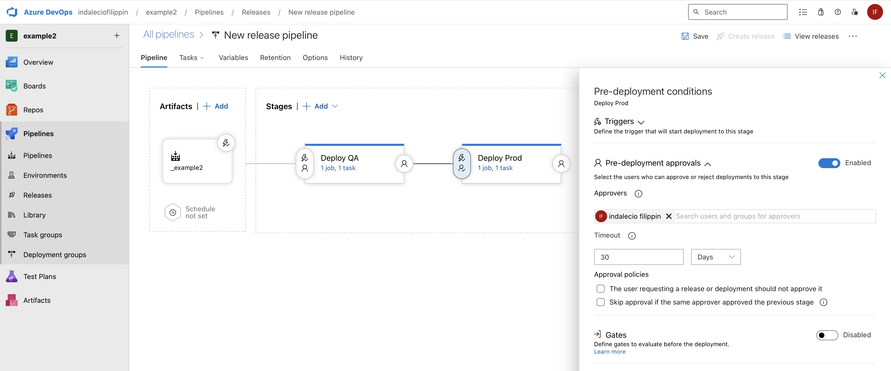
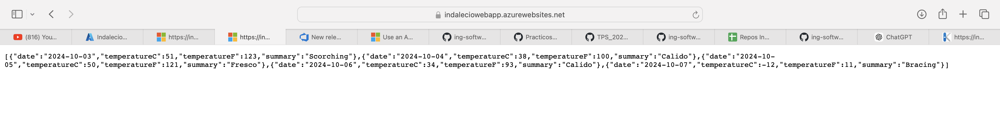

# Trabajo Práctico 5 - Despliegue de aplicaciones con Azure Devops Release Pipelines

## 1\. Crear una cuenta en Azure

## 2\. Crear un recurso Web App en Azure Portal y navegar a la url provista

## 3\. Actualizar Pipeline de Build para que use tareas de DotNetCoreCLI@2 como en el pipeline clásico, luego crear un Pipeline de Release en Azure DevOps con CD habilitada

## 4\. Optimizar Pipeline de Build

## 5\. Verificar el deploy en la url de la WebApp /weatherforecast

Se modifico la version de .NET para que el deploy se realice correctamente.

## 6\. Realizar un cambio al código del controlador para que devuelva 7 pronósticos, realizar commit, evaluar ejecución de pipelines de build y release, navegar a la url de la webapp/weatherforecast y corroborar cambio

## 7\. Clonar la Web App de QA para que contar con una WebApp de PROD a partir de un Template Deployment en Azure Portal y navegar a la url provista para la WebApp de PROD.

## 8\. Agregar una etapa de Deploy a Prod en Azure Release Pipelines

## 9\.  Realizar un cambio al código del controlador para que devuelva 10 pronósticos, realizar commit, evaluar ejecución de pipelines de build y release, navegar a la url de la webapp/weatherforecast y corroborar cambio, verificar que en la url de la webapp_prod/weatherforecast se muestra lo mismo.

- QA

- Produccion

## 10\. Modificar pipeline de release para colocar una aprobación manual para el paso a Producción.

## 11\. Realizar un cambio al código del controlador para que devuelva 5 pronósticos, realizar commit, evaluar ejecución de pipelines de build y release, navegar a la url de la webapp/weatherforecast y corroborar cambio, verificar que en la url de la webapp_prod/weatherforecast aun se muestra la versión anterior.

- Produccion

- QA

## 12\. Aprobar el pase ya sea desde el release o desde el mail recibido.

## 13\. Esperar a la finalización de la etapa de Pase a Prod y luego corroborar que en la url de la webapp_prod/weatherforecast se muestra la nueva versión coinicidente con la de QA.

Una vez aprobado y finalizado el release, vamos a la url y vemos los cambios realizados.

## 14\. Realizar un pipeline (no release) que incluya el deploy a QA y a PROD con una aprobación manual. El pipeline debe estar construido en YAML sin utilizar el editor clásico de pipelines ni el editor clásico de pipelines de release.

Antes de aprovar produccion:

Se hizo un commit en donde el programa devuelve 8 pronosticos, a continuacion se muestra que antes de aprovar la produccion solo es visible en QA.

Luego continuamos con la aprovacion y vemos que es visible ahora tambien en Produccion.

